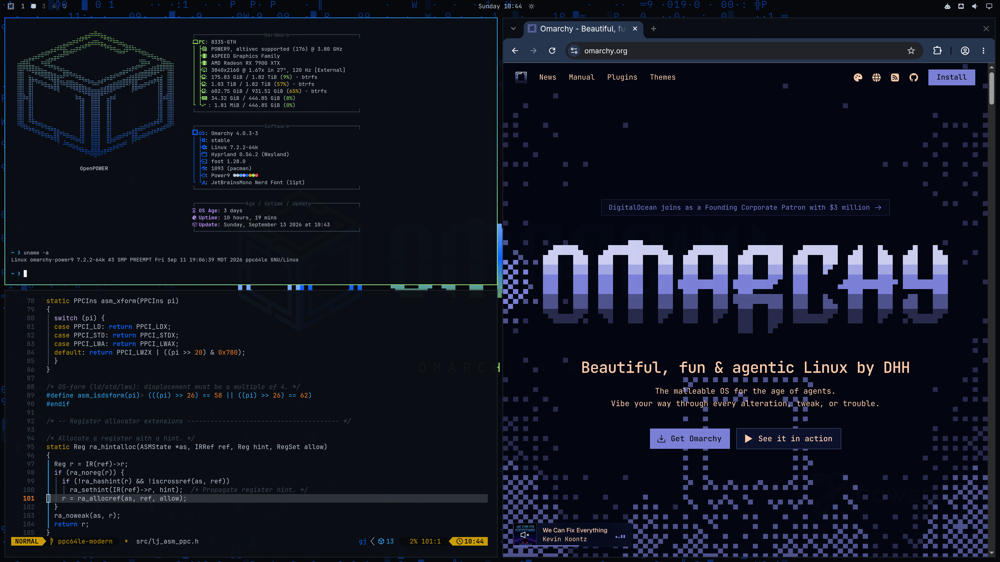
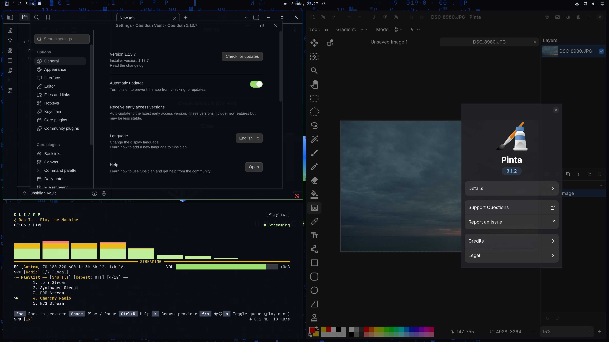
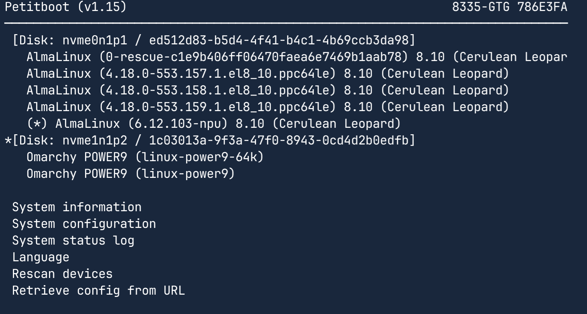
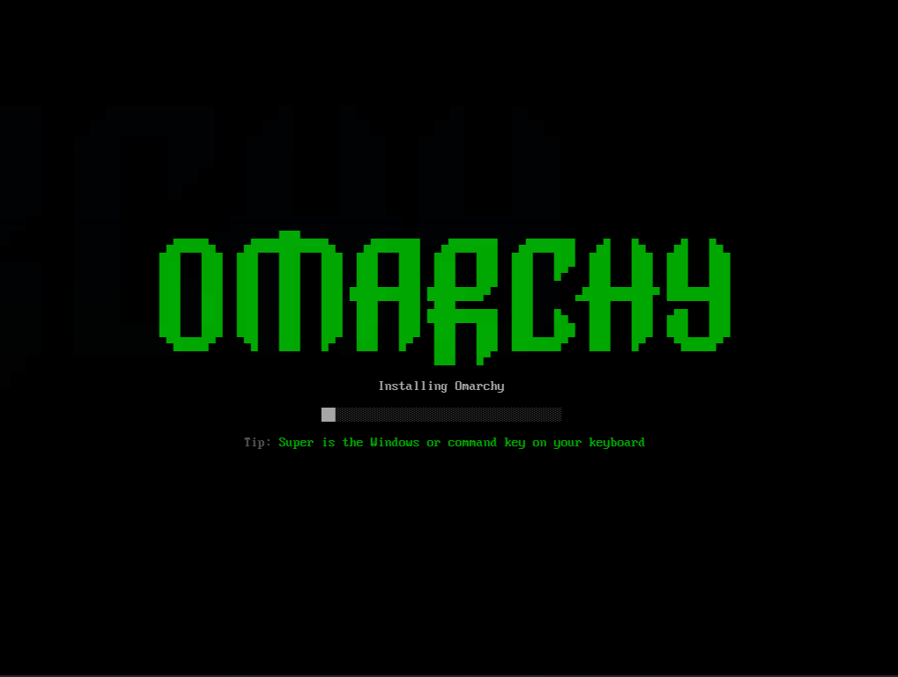
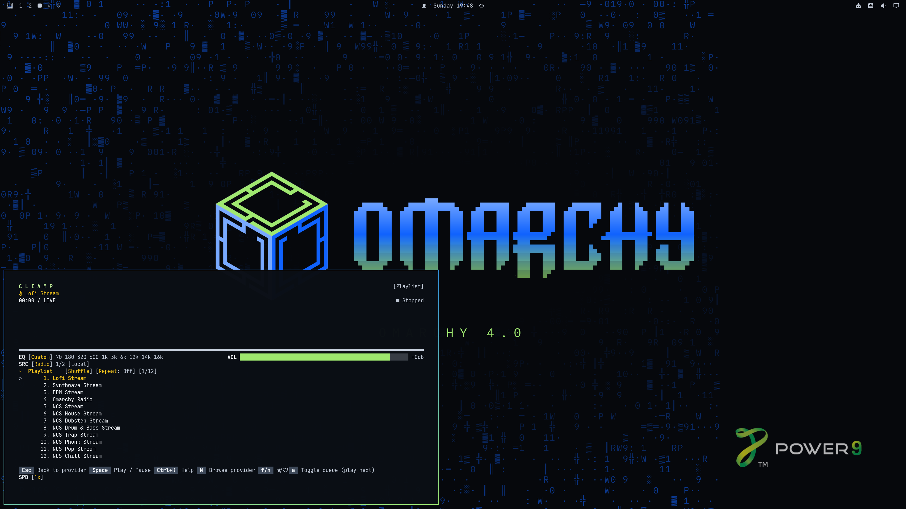

# Omarchy for POWER

[](#status)
[](#status)
[](docs/power8-secondary-target.md)
[](https://github.com/omacom/omarchy)
[](#not-available-yet)
[](https://github.com/jbettcher-wg/omarchy-ppc64le/commits/master)
[](LICENSE)

[Omarchy](https://github.com/omacom/omarchy) (Arch Linux + Hyprland), ported to
**powerpc64le**. It's built on [Arch POWER](https://archlinuxpower.org) and
aimed first at **POWER9** machines.



## Status

Omarchy **4.0.3** runs as a daily desktop on an IBM AC922 (8335-GTH, POWER9,
176 threads, Radeon RX 7900 XTX). That includes the Hyprland session, the
Omarchy shell and plugins, Chromium, Neovim with LazyVim on a JIT-enabled
LuaJIT, and `omarchy update`.

| | |
|---|---|
| Omarchy base packages available | **146 of 147** (only `localsend` is missing, below) |
| Packages in the `omarchy-ppc64le` pool (baseline, runs on every ppc64le machine) | building |
| Packages in the `omarchy-power9` pool (POWER9-optimised, opt-in) | 1,350 |
| Build scripts in [omarchy-ppc64le-packaging](https://github.com/jbettcher-wg/omarchy-ppc64le-packaging) | 4,562 pkgbases, 199 of them ours |
| Omarchy version | 4.0.3, stable channel (`omarchy` 4.0.3-3, `omarchy-settings` 4.0.3-2) |
| Kernel | `linux-power9` 7.2.2 (4K pages) and `linux-power9-64k` |
| Installer | ISO + `p9-install`, PowerNV and pSeries |
| Release channel | not public yet; packages are unsigned |

## Package pools

The distribution ships **two package pools**, built from the same recipes. A
build is named for what it *runs on*, not for what it was tuned for.

| pool | built | runs on | role |
|---|---|---|---|
| **`omarchy-ppc64le`** | POWER8-legal (ISA 2.07) | POWER8 → POWER11, i.e. **every ppc64le machine** | **the baseline, and the default.** What the ISO installs from, what the installer writes into `/etc/pacman.conf`, what external testers use |
| `omarchy-power9` | `-mcpu=power9`, ISA 3.0 | POWER9 only | an **opt-in extra** for machines known to be POWER9, layered *ahead* of the baseline |

Layered means exactly what pacman does with repo order: with both configured,
`[omarchy-power9]` is listed first, so an optimised package wins where one
exists and the baseline fills in the rest. Nothing has to be built twice for a
machine to get a complete system — the baseline alone is complete.

How the POWER8-legal build is produced, and which recipes pin an ISA of their
own: [`docs/power8-secondary-target.md`](docs/power8-secondary-target.md).

## Repositories

The distribution is two **git** repositories.

| | |
|---|---|
| **this one** | the installer and ISO, the build tooling, the repo databases, and the docs |
| [**omarchy-ppc64le-packaging**](https://github.com/jbettcher-wg/omarchy-ppc64le-packaging) | every build script the distribution builds from — 4,562 pkgbases, 199 of them ours |

No PKGBUILD lives here. A builder needs both, and locates the packaging tree
through `OMARCHY_PACKAGING`:

```sh
git clone git@github.com:jbettcher-wg/omarchy-ppc64le.git
git clone git@github.com:jbettcher-wg/omarchy-ppc64le-packaging.git
export OMARCHY_PACKAGING=$PWD/omarchy-ppc64le-packaging
```

Clone them side by side under `~/Development` and the variable is unnecessary —
that is the default the tools assume.

### Notable ports

- **LuaJIT with a working ppc64le JIT backend**
  ([jbettcher-wg/luajit-ppc64le](https://github.com/jbettcher-wg/luajit-ppc64le)).
  It's the first one, as far as we know. Neovim and Omarchy's LazyVim config run
  on it.
- **Chromium 151**, with the Debian ppc64le patch set and POWER9/POWER8 build
  modes.
- **Electron 43** (Chromium 150, Node 24), and **Obsidian** on it.
- **.NET 10 built from source**, with a fix to Mono's ppc64le JIT for ELFv2
  struct returns, so GTK apps like **Pinta** run. The one-time bootstrap is
  documented in [`docs/dotnet-ppc64le-bootstrap.md`](docs/dotnet-ppc64le-bootstrap.md).
- **Qt 6 WebEngine**, **Blender 5.1** (VSX Cycles)
- The full **Hyprland** stack, **quickshell**, and Omarchy's own apps and tools
  (omacalc, omacut, omawrite, tensaku, herdr, cliamp, aether, ttfx, tobi-try).
- Toolchains: **Go 1.27**, **Zig 0.16** (and 0.15 for herdr), LLVM 20/21.
- **ROCm/HIP 7.2.4** and **llama.cpp** for Radeon compute.



### Not available yet

| Package | Why |
|---|---|
| `localsend` | Flutter app; the Dart VM has no ppc64le back end yet.... |
| `limine`, `limine-snapper-sync` | not applicable; POWER boots through petitboot (below) |

## How it differs from upstream Omarchy

- **Boot.** OpenPOWER firmware boots through **petitboot**, not limine. The
  installer writes a `grub.cfg` that petitboot reads, and a pacman hook keeps
  it current. There are no bootable snapshots; `snapper` is optional.
- **Packages.** They come from our own pool — `[omarchy-ppc64le]` by default,
  optionally `[omarchy-power9]` ahead of it — listed ahead of Arch POWER's
  `[base]` and `[base-any]`, instead of pkgs.omarchy.org.
- **`omarchy` and `omarchy-settings` are upstream's packages, repacked.** They
  contain no machine code. The recipes drop the limine/snapper/keyring
  dependencies and the update guard hook.
- **Hardware support is clipped.** Intel and NVIDIA graphics, Apple T2, x86
  laptop quirks and multilib don't apply;
  [`installer/share/p9-clipped.packages`](installer/share/p9-clipped.packages)
  lists every dropped package and why.
- **Theme.** `omarchy-theme-power9` is the default theme.

## Using the repository

Add the repo **ahead of** Arch POWER's repos in `/etc/pacman.conf`. The
baseline pool is the one to use unless you know the machine is a POWER9:

```ini
[omarchy-ppc64le]
SigLevel = PackageNever DatabaseOptional TrustAll
Server = https://omappc64le.download/omarchy-ppc64le

[base-any]
Server = https://repo.archlinuxpower.org/base/any

[base]
Server = https://repo.archlinuxpower.org/base/$arch
```

On a POWER9 machine you can layer the optimised pool **ahead of** the
baseline — repo order is what does the overriding, so you get the optimised
build of everything it carries and the baseline for the rest:

```ini
[omarchy-power9]
SigLevel = PackageNever DatabaseOptional TrustAll
Server = https://omappc64le.download/omarchy-power9

[omarchy-ppc64le]
SigLevel = PackageNever DatabaseOptional TrustAll
Server = https://omappc64le.download/omarchy-ppc64le

[base-any]
Server = https://repo.archlinuxpower.org/base/any

[base]
Server = https://repo.archlinuxpower.org/base/$arch
```

The repo is served from Cloudflare R2. Packages are **not signed yet**, which is
why `SigLevel` is `PackageNever DatabaseOptional TrustAll`: `PackageNever` also
stops pacman from asking for `.sig` files, whose 404 page is larger than
pacman's signature size limit and would abort downloads under plain
`Optional`. Signing, and restoring `omarchy-keyring`, is planned.

Many packages here are rebuilds of Arch POWER packages under the same name. If
something from `[omarchy-ppc64le]` or `[omarchy-power9]` misbehaves, report it
here first rather than to Arch POWER.

Updates work through `omarchy update` or plain `pacman -Syu`. For now
`omarchy update` prints harmless errors from its keyring step
(`omarchy-keyring` and `archlinux-keyring` don't exist on Arch POWER). Our
`omarchy` package reports a system using one of our pools as the **stable**
channel.

## Installing

Build the ISO (needs root for `mkarchiso`, plus the
[kth5/archiso](https://github.com/kth5/archiso) fork at `../archiso-power`):

```sh
iso/build.sh                 # baseline: https://omappc64le.download/omarchy-ppc64le
iso/build.sh --power9        # the POWER9-optimised pool instead
iso/build.sh --bundle-repo   # also embeds the pool, to test unpublished packages
iso/build.sh --print-config  # show the resolved pool, db and servers; build nothing
```

The default ISO installs the **baseline** pool, which runs on any ppc64le
machine; `--power9` builds one for the optimised pool, and `--repo-name` /
`--pool` name the two halves by hand. The install needs a network connection:
packages come from our pool and Arch POWER.

Output goes to `iso/out/omarchy-p9-YYYY.MM.DD-ppc64le.iso`. Booting it starts
`p9-configurator`, which asks for keyboard, user, disk and timezone, and shows a
summary with the target disk's serial for confirmation. It then runs
`p9-install` under Omarchy's own install dashboard, so the install looks like
upstream's:
- a progress bar driven by the packages actually installed;
- a failure screen with the log tail and options to view the log, reboot or
  drop to a shell;
- a **Reboot Now** prompt when it finishes.

On PowerNV machines the installed system appears in petitboot alongside
anything else on the box, with one entry per installed kernel:





`p9-install` supports **PowerNV** (bare metal: AC922, Talos II, Blackbird and
other skiboot/petitboot machines) and **pSeries** (KVM/PowerVM guests; it adds
a PReP partition and GRUB). The
layout matches upstream: GPT, ext4 `/boot`, btrfs `/` with `@ @home @log @pkg`
subvolumes. Omarchy's configuration runs on first boot through
`p9-firstboot`. See [`installer/README.md`](installer/README.md).

Testing:
- `installer/test/run-guest.sh prepare|serve|install|boot` runs a full install
  and boot in QEMU `powernv9` through petitboot.
- `tests/qemu-smoke.sh` boots the newest ISO as a pSeries guest.
- `tests/installer-dryrun.sh` exercises the installer's argument and safety
  checks.

## Building packages

Everything is built unprivileged. `tools/bq.py` orders the build, layers build
dependencies with `bwrap` overlays (no chroot, no sudo), runs several packages
in parallel and caches compiles with ccache.

Build scripts live in their own repository,
[**omarchy-ppc64le-packaging**](https://github.com/jbettcher-wg/omarchy-ppc64le-packaging)
— every PKGBUILD the distribution builds from, curated by us. Clone it beside
this one, or point `OMARCHY_PACKAGING` at it:

```sh
git clone git@github.com:jbettcher-wg/omarchy-ppc64le-packaging.git \
  ~/Development/omarchy-ppc64le-packaging      # the default location
# edit <category>/<pkg>/PKGBUILD there, bump pkgrel
tools/bq.py build <pkg> [-j N] [--rebuild --force]
tools/repo-publish.sh              # dry run: what would change in omarchy-power9
tools/repo-publish.sh --commit     # write the published DB
REPO=$PWD/repo-ppc64le REPO_NAME=omarchy-ppc64le tools/repo-publish.sh --commit
                                   # ... and the same for the baseline pool
tools/build-ppc64le.sh <pkg>       # build into the baseline pool (POWER8-legal)
```

Recipes are discovered by pkgbase, **recursively**, in that one tree — nothing
else is a build-time source. Arch's GitLab and the AUR are import sources
reached through `tools/fetch.sh`, which places a fetched recipe in the right
category inside the packaging tree, where it is reviewed and committed. That
split is deliberate: when three trees could each supply a recipe, versions
drifted silently between builders. A pkgbase claimed by two directories is an
error, never resolved by picking one, and a recipe older than the version our
repo database ships is refused and logged (`--allow-downgrade` overrides): we
do not downgrade for parity. Every package passes path guards that reject
build-tree paths and stray install locations. Full details are in [`docs/build-queue.md`](docs/build-queue.md).

### Releasing a new Omarchy version

1. Read upstream's `omarchy.db`: filename, `%SHA256SUM%`, depends.
2. Read the new migrations; a failing migration aborts `omarchy update`.
3. Bump `pkgver` and the checksum in `ours/omarchy` and
   `ours/omarchy-settings` in the packaging tree, build, and publish.

## Layout

| Path | Contents |
|---|---|
| `tools/` | `bq.py` build queue, `repo-publish.sh`, dependency closure and soname/repo gap checks, path guards, sysroot helpers |
| `installer/` | `p9-install`, the ISO configurator, first-boot layer, QEMU test rig |
| `iso/` | archiso profile and `build.sh` |
| `tests/` | ISO smoke test, installer dry-run tests |
| `manifest/` | generated dependency closure and build order |
| `docs/` | build system, package status, POWER8 plan, upstreamable patches, investigations |
| `RULES.md` | working rules for this tree |
| `repo-ppc64le/`, `repo/` | the baseline and POWER9-optimised package pools: built packages and repo DBs (not in git) |
| `upstream/` | reference clones of `omarchy` and `omarchy-iso` (not in git) |

Build scripts are not here; see [Repositories](#repositories).

## Upstream work

Portability fixes that belong upstream are tracked in
[`docs/upstreamable-patches.md`](docs/upstreamable-patches.md), for Omarchy,
Arch POWER and individual projects. Patches carry a header saying whether they
are upstreamable or a local workaround.

## License

The tooling, installer, docs and our own recipes and patches are
[MIT](LICENSE). Recipes adapted from Arch Linux, Arch POWER or the AUR, and
patches taken from other projects, keep their original licences; see each
package directory in the packaging repository (`LICENSE`, `REUSE.toml` or the
patch header).

## Credits

- [Omarchy](https://github.com/omacom/omarchy)
- [Arch POWER](https://archlinuxpower.org), the base distribution
- the [PPC64/LuaJIT](https://github.com/PPC64/LuaJIT) interpreter port that the
  JIT backend builds on
- Debian's chromium team (ppc64le patches)
- Fedora (Qt WebEngine ppc64le patches)
- [kth5/archiso](https://github.com/kth5/archiso) (OpenPOWER boot support)

Maintained by Jordan Bettcher.


